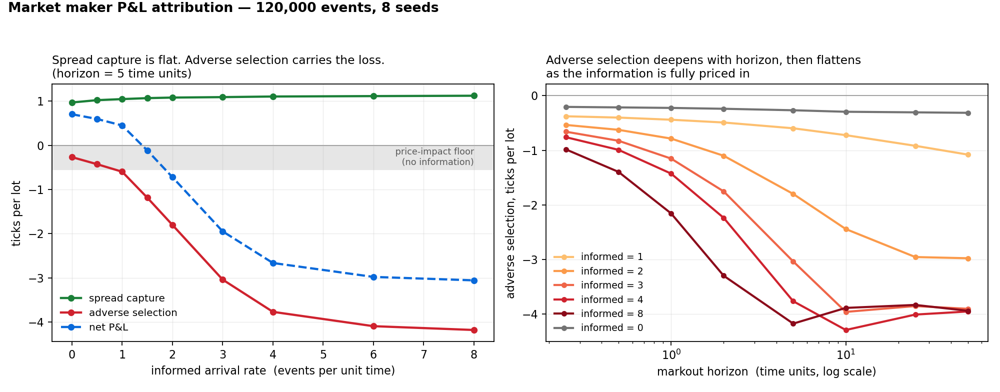

# Market Maker Limit Book Simulator

[](https://github.com/aleexcolleet/MarketMakerLimitBookSim/actions/workflows/ci.yml)

A price-time priority limit order book and a synthetic market in C++17, built to measure where a
market maker's P&L actually comes from — and where it leaks.



**Spread capture is flat at about +1.0 ticks per lot whatever the informed-flow intensity.
Adverse selection carries the entire loss.** That separation is the point of the project, and
the rest of this README is how it is arrived at and why the numbers can be trusted.

```
  [spread]     informed 0: +0.98/lot      informed 4: +1.11/lot
  [adverse]    informed 0: -0.29/lot      informed 4: -3.54/lot
  [control]    frozen latent value:       spread +1.05, adverse -0.51
  [validation] mid-based -2.94/lot  vs  latent-value truth -3.05/lot
```

---

## Why

A market maker does not forecast price. It quotes two-sided prices, earns the spread, and manages
the inventory it accumulates. Its main enemy is **adverse selection**: the counterparties who
trade against it are, on average, better informed at the moment they trade, so the quotes that get
hit are disproportionately the wrong ones.

That makes a market maker's P&L a mix of two opposing components:

- **Spread capture** — positive, earned from participants trading for reasons unrelated to value
- **Adverse selection** — negative, paid to participants trading *because* of value

Gross P&L hides both. Separating them is the only way to tell whether a quoting strategy is
genuinely profitable or merely lucky in a trending sample.

**Doing that on real data is impossible**, because there is no observable "true value" to measure
against. Here there is one — a latent value process the market maker cannot see — which is what
makes the result checkable rather than asserted.

## Build and test

```bash
cmake -B build
cmake --build build -j
ctest --test-dir build
```

Requires CMake ≥ 3.16 and a C++17 compiler. **No external dependencies.**

With sanitizers:

```bash
cmake -B build-asan -DMMS_SANITIZE=ON -DCMAKE_BUILD_TYPE=Debug
cmake --build build-asan -j && ctest --test-dir build-asan
```

**5,369 assertions** across five suites, clean under `-Werror -Wall -Wextra -Wpedantic -Wshadow
-Wconversion` and under AddressSanitizer + UndefinedBehaviorSanitizer.

CI runs the suite on every push across **three toolchains** — GCC and Clang on Linux, AppleClang on
macOS — plus a sanitizer job. Three rather than one because the project's central claim is that a
run reproduces exactly, and the standard library is where that breaks: libstdc++ and libc++ are
free to differ, which is why the random distributions here are hand-written (D12).

Reproducing the chart:

```bash
./build/mms_sweep > docs/attribution.csv
python3 tools/plot_attribution.py docs/attribution.csv docs/attribution.png
```

---

## What it does

### The matching engine

Price-time priority. Incoming orders cross against the opposite side, best price first and FIFO
within a level, executing at the **resting** order's price rather than the aggressor's. Limit
orders rest their remainder; market and IOC orders match but never rest.

**Partial fills retain queue position.** Not by special-casing — the front order is decremented
and not popped, so nothing reorders the queue. The bug would be adding code, not omitting it.

Cancellation from any queue position, with the price level erased once it empties, and `false`
returned for unknown ids rather than an exception — in a real venue cancels race against fills
constantly, so cancelling a filled order is normal operation.

Queries (`best_bid`, `best_ask`, `top_of_book`, `size_at`, `total_quantity`, `depth`) are O(1),
with level totals and a live-order count maintained incrementally.

### The market

Order flow arrives as a **Poisson process**. Independent processes superpose, so the whole arrival
structure is one exponential draw for *when* and one categorical draw for *what* — four
participant types on a single clock.

- **Background liquidity** posts limit orders relative to the *opposite* touch, so it can never be
  marketable. All aggression in the simulation is chosen rather than accidental.
- **Uninformed traders** send market orders, buying or selling with probability ½. They lose about
  0.8 ticks per lot — roughly half the prevailing spread, which is what crossing it costs.
- **Informed traders** observe a **latent value** with noise and take whichever side of the book is
  on the wrong side of it, using IOC limited at their perceived fair value, and only when the
  mispricing exceeds a threshold.

Cancellation intensity is **per resting order**, not per market. A constant cancel rate has no
equilibrium against a constant arrival rate — the book grew to 11,766 resting orders and price
discovery failed by 140 ticks before this was fixed. See D18.

Price discovery emerges: nothing in the book knows the latent value, yet the mid tracks it to
within **3.8 ticks** while the value random-walks, and **0.86 ticks** when it is frozen.

### The market maker

Constructed with an `OrderBook` **and nothing else**. It has no `ValueProcess` and no way to reach
one, so it never sees the latent value — everything it believes about fair value comes from the
book, which is the information a real one has.

It estimates fair from the touch **excluding its own quotes** (otherwise it reads its own mid back
and the estimate freezes), quotes symmetrically around it, skews both quotes against inventory,
and sizes each quote against its remaining position limit.

Skew takes mean |position| from **636 lots to 12.9**. It is not monotonically good — at
`skew_per_lot = 0.10` the maker walks itself away from the market and inventory runs to 2,410. A
control loop with too much gain oscillates.

### The attribution

For each fill at time *t*, price *P*, signed size *Q*:

```
spread capture     = (M(t)   − P)    × Q      what you earned for providing immediacy
adverse selection  = (M(t+τ) − M(t)) × Q      how the market moved against you afterwards
                     ─────────────────────
markout P&L(τ)     = (M(t+τ) − P)    × Q      the two sum to this, exactly
```

`M` is the mid — and that choice is the whole thing. Measured against the *latent value* instead,
the entire cost of informed flow lands in spread capture, because the mid is already stale at
trade time and the latent value is a martingale afterwards. Adverse selection is the market's
**correction**, and the mid is the thing that corrects. See D29.

Both decompositions are computed. The mid-based pair is the headline; the latent-value pair
validates it.

---

## Two results worth the project

### The observable measure recovers the unobservable truth

Mid-based markout against latent-value truth at `rate_informed = 4`, across six seeds:

| seed | mid-based | truth | difference |
|---|---|---|---|
| 0xC0FFEE | −2.94 | −3.05 | +0.11 |
| 1 | −2.17 | −2.50 | +0.33 |
| 2 | −2.12 | −2.30 | +0.18 |
| 42 | −2.54 | −2.33 | −0.21 |
| 999 | −3.61 | −3.64 | +0.03 |
| 7 | −2.24 | −2.23 | −0.01 |

Agreement to about a third of a tick. **This is a validation of markouts as a technique, and only
a simulator can produce it** — on real data there is no latent value to check against.

### Markouts have a mechanical floor

Freeze the latent value entirely, so there is nothing to be informed *about*, and run informed
participants anyway:

```
spread +1.05/lot    adverse -0.51/lot    total +0.54/lot
```

Adverse selection is **not zero**. That is **price impact**, not information: the aggressive order
consumes liquidity and moves the mid regardless of whether anyone knew anything.

So the measure has a floor — the shaded band in the chart — and the informational component is
what lies below it. At `rate_informed = 4`, roughly −3.0 is information and −0.5 is mechanics.

---

## Design

```
include/mms/
  types.hpp          domain types — integer tick prices, orders, trades
  order_book.hpp     public interface, no implementation detail exposed
  random.hpp         deterministic random source
  value_process.hpp  the latent "true" value
  flow.hpp           participants and the Poisson generator
  market_maker.hpp   the quoting agent
  attribution.hpp    markout-based P&L decomposition
src/                 order_book, flow, market_maker, attribution
tests/               five suites, 5,369 assertions
tools/               sweep driver and the plotting script
```

Thirty-three numbered decisions, each with its alternatives and accepted cost, are in
[docs/DESIGN.md](docs/DESIGN.md). Five worth stating here.

**Prices are integers, in ticks — never floating point.** Binary floating point cannot represent
0.1 exactly, so price equality (tested on every incoming order) becomes unreliable and rounding
error accumulates across fills until P&L is fiction. `TopOfBook::mid_x2()` returns *twice* the mid
for the same reason: with a one-tick spread, integer division would silently lose half a tick,
which is larger than the edge being measured.

That half tick has mattered twice. The market maker's first version rounded the mid before quoting
around it; because the market spread is odd about 70% of the time, that pushed both quotes half a
tick in the same direction and the maker accumulated a **724-lot position on 934 lots of volume**
before it was found. Quotes are now rounded *outward* from an unrounded mid.

**Bids and asks use opposite comparators.** `std::greater<Price>` on bids, `std::less<Price>` on
asks, so `begin()` is the best price on *both* sides and the matching loop never branches on side.
The cost is that the two maps are different types, so shared logic is a template — compile-time
polymorphism rather than virtual dispatch on the order-entry path.

**The engine is a deterministic core.** No I/O, no logging, no wall clock — timestamps are a field
on `Order`, supplied by the caller. The random distributions are hand-written rather than taken
from `<random>`, because the standard specifies the *engines* bit-for-bit but not the
*distributions*: libstdc++ and libc++ consume different numbers of engine outputs per variate, so
the same seed would produce different simulations on different machines. Verified — identical
output to four decimal places under GCC/libstdc++/Linux and AppleClang/libc++/macOS.

**Components are given exactly the information they should have.** The market maker sees the book.
The attribution sees the book, the latent value and the clock. Merging them would mean handing the
maker the latent value, at which point it could quote off it and every number becomes an artefact.

**The container choice is deliberately provisional.** `std::map` was chosen because getting
matching semantics right mattered more than memory layout; a flat array indexed by price offset is
the expected replacement once there are benchmarks to justify it. Recorded as D2, still open.

---

## Tests

The suite is the specification. Beyond the obvious cases, three kinds of test carry the weight.

**Property tests.** Across thousands of randomly generated orders the book must never cross itself
(`bid < ask` always) and quantity must be conserved (`submitted == resting + 2 × traded`). The
factor of two is because each trade consumes a lot from the aggressor *and* one from a resting
order, both counted in the submitted total.

**Controls.** The strongest results in the project are not assertions about the happy path — they
are what happens when a mechanism is switched off:

| Control | Result |
|---|---|
| Freeze the latent value | informed edge collapses from +3.61 to **+0.09**/lot |
| Freeze the latent value | the maker becomes profitable again despite informed flow |
| Freeze the latent value | adverse selection falls to the price-impact floor |
| Remove the market maker | thousands of trades occur, nothing is attributed |
| Remove informed flow | the maker is profitable, adverse selection is shallow |

Without the first of these, an edge produced by some artifact of the mechanics — order type,
timing, sizing — would look identical to an edge produced by information.

**Cross-checks.** `MarketMaker` tracks cash and inventory and marks at the latent value;
`PnlAttribution` sums markouts over individual fills. Completely different code paths, agreeing at
−2.94 against −3.10 per lot. Two independent routes to the same number is a much stronger
statement than either alone.

Every statistical test is **seeded**. An unseeded one fails about one run in a hundred, and a suite
that fails occasionally is a suite people learn to ignore.

---

## Not implemented

Explicitly, because a project that is clear about its boundaries is more useful than one that is
vague about them:

- Order modification, self-trade prevention, auctions
- Concurrency of any kind — the engine is single-threaded and makes no attempt to be otherwise
- Throughput or latency benchmarks; the container choice is therefore unmeasured
- Multi-instrument or cross-asset effects
- Strategic participants: the flow model is a zero-intelligence baseline in the sense of Farmer,
  Patelli & Zovko, extended with one informed class

## Roadmap

- [x] Domain types, build system, test suite
- [x] Order resting, cancellation, depth and query surface
- [x] Matching engine — limit, market and IOC orders, partial fills, price-time priority
- [x] Deterministic random source and a latent value process with diffusion and jumps
- [x] Synthetic order flow: Poisson arrivals, informed and uninformed participants
- [x] Market-making agent: two-sided quoting, inventory skew, position limits
- [x] P&L attribution: markout-based decomposition into spread capture and adverse selection
- [ ] Throughput and latency benchmarks (p50/p99/p99.9), then closing D2 with a flat-array book

## Licence

MIT
